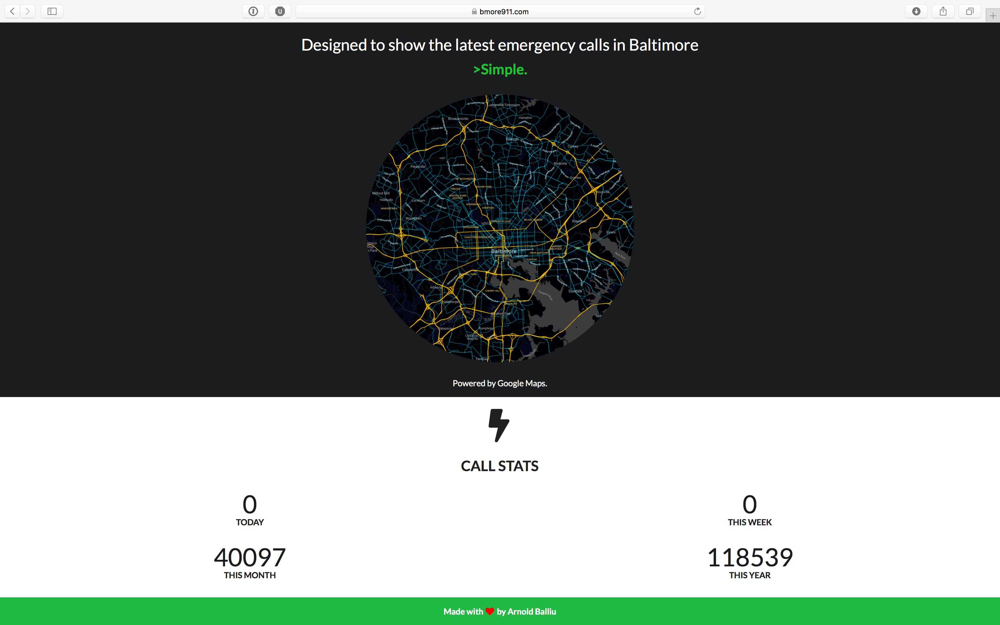
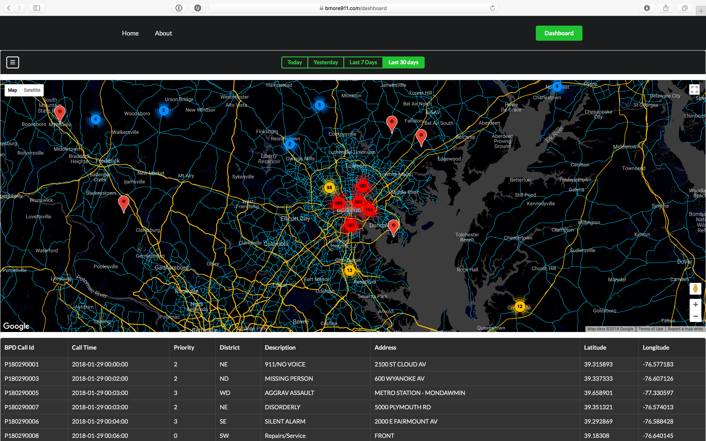
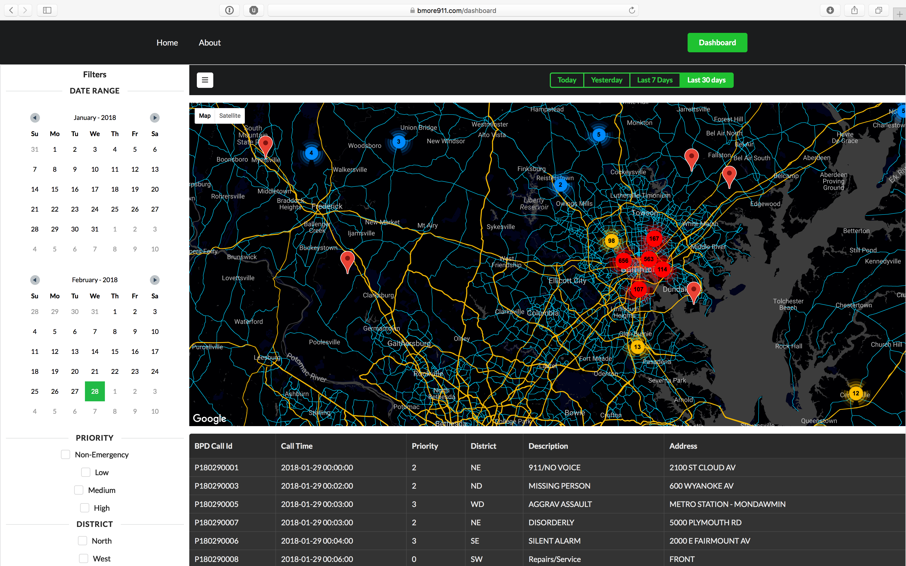
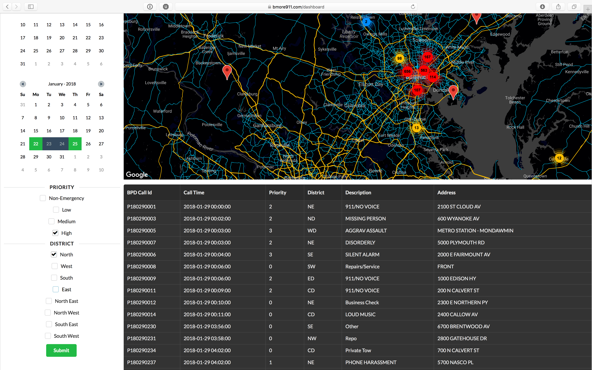
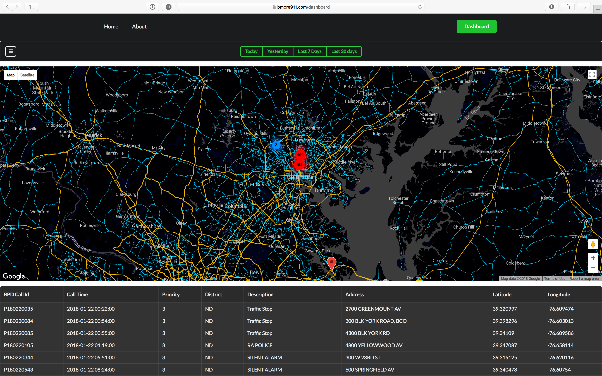

# BMORE911

TRAVIS-CI: [](https://travis-ci.org/arn95/Bmore911)

Portal is live: https://bmore911.com

## Table of Contents

- [Project Summary](#project-summary)
  - [Solving a problem](#solving-a-problem)
  - [Features](#features)
  - [Upcoming Features](#upcoming-features)
  - [Usage](#usage)
    - [Homepage](#homepage)
    - [Dashboard](#dashboard)
      - [Searching](#searching)
- [Project Setup](#project-setup)
  - [Updating React to New Releases](#updating-to-new-releases)
  - [Available Scripts](#available-scripts)
    - [npm start](#npm-start)
    - [npm test](#npm-test)
    - [npm run build](#npm-run-build)
    - [npm run eject](#npm-run-eject)
  - [Installing a Dependency](#installing-a-dependency)
  - [Importing a Component](#importing-a-component)
  - [Adding a Stylesheet](#adding-a-stylesheet)
  - [Post-Processing CSS](#post-processing-css)
  - [Adding a CSS Preprocessor (Sass, Less etc.)](#adding-a-css-preprocessor-sass-less-etc)
  - [Adding Images, Fonts, and Files](#adding-images-fonts-and-files)
  - [Using the `public` Folder](#using-the-public-folder)
    - [Changing the HTML](#changing-the-html)
    - [Adding Assets Outside of the Module System](#adding-assets-outside-of-the-module-system)
    - [When to Use the `public` Folder](#when-to-use-the-public-folder)
  - [Using Global Variables](#using-global-variables)
  - [Proxying API Requests](#proxying-api-requests)
    - ["Invalid Host Header" Errors After Configuring Proxy](#invalid-host-header-errors-after-configuring-proxy)
    - [Configuring the Proxy Manually](#configuring-the-proxy-manually)
    - [Configuring a WebSocket Proxy](#configuring-a-websocket-proxy)
  - [Running Tests](#running-tests)
    - [Filename Conventions](#filename-conventions)
    - [Command Line Interface](#command-line-interface)
    - [Version Control Integration](#version-control-integration)
    - [Writing Tests](#writing-tests)
    - [Testing Components](#testing-components)
    - [Initializing Test Environment](#initializing-test-environment)
    - [Focusing and Excluding Tests](#focusing-and-excluding-tests)
    - [Coverage Reporting](#coverage-reporting)
    - [Continuous Integration](#continuous-integration)
    - [Disabling jsdom](#disabling-jsdom)
    - [Snapshot Testing](#snapshot-testing)
  - [Making a Progressive Web App](#making-a-progressive-web-app)
    - [Opting Out of Caching](#opting-out-of-caching)
    - [Offline-First Considerations](#offline-first-considerations)
    - [Progressive Web App Metadata](#progressive-web-app-metadata)
  - [Analyzing the Bundle Size](#analyzing-the-bundle-size)
  - [Deployment](#deployment)
    - [Static Server](#static-server)
    - [Other Solutions](#other-solutions)
    - [Serving Apps with Client-Side Routing](#serving-apps-with-client-side-routing)
    - [Building for Relative Paths](#building-for-relative-paths)
    - [Heroku](#heroku)
  - [Troubleshooting](#troubleshooting)
    - [`npm start` doesn’t detect changes](#npm-start-doesnt-detect-changes)
    - [`npm test` hangs on macOS Sierra](#npm-test-hangs-on-macos-sierra)
    - [`npm run build` exits too early](#npm-run-build-exits-too-early)
    - [`npm run build` fails on Heroku](#npm-run-build-fails-on-heroku)
    - [`npm run build` fails to minify](#npm-run-build-fails-to-minify)
    - [Moment.js locales are missing](#momentjs-locales-are-missing)
- [Contact](#contact)


## Project Summary

Bmore911 front-end displays the latest phone calls received by Baltimore Police Dept. as soon as they become available. The app fetches data from https://api.bmore911.com which processes the call record files published by BPD in https://data.baltimorecity.gov. Due to the amount of records the app is limited to providing call data only for the current year. The app uses ReactJS and is built from scratch using Semantic-UI React components and a bunch of other libraries such as react-google-maps that provide the React wrapper component for Google Maps. It is hosted on Heroku with a free account using an instance of ClearDB (MySQL-as-a-service) addon provided by Heroku. It's on a paid plan of 1GB due to the amount of phone calls stored in it. Bmore911 app makes use of continuous integration using Travis-CI. Please find .travis.yml in the root dir to check out config.

### Solving a Problem
You can find a similar tool at https://data.baltimorecity.gov portal, however, it is almost unusable. It operates very slow due to the massive amounts of data it handles in the background and the call location markers on the map are not clustered and therefore it is hard to tell concentrations. This portal only handles this years records and operates in limited timeframes for casual usage. It is easy to navigate and use and there are no complex filters or criteria to actually show something on the screen. Markers shown are clustered to pinpoint concentrations of calls in different parts of the city. In addition it provides quick stats in the homepage for someone just interested in knowing for example how many calls were made today, or this week.

### Features
* Display of phone call locations in map using MarkerCluster to group markers.
* Table that displays phone call details such as Call Time, Priority, Description, District, Street Address, Longitude, Latitude.
* Filtering of calls by start date or end date (or both), priority and district.
* Homepage displays count of phone calls made today, this week, this month and this year.
* Google Map embed allows zooming, scrolling and clicking of marker clusters.

### Upcoming Features
* More filter options.
* Standardize call record descriptions and provide a way to filter results using them.
* Add InfoBox on markers to display phone call details on click.
* Performance improvements.
* Add more stats in the homepage. Maybe redesign the homepage to make stats more visible.

### Issues
* Series of searches that return large batches of records slow the site down to the point of freezing due to the deallocation and reallocation of markers in the map. This is either due to the fact that I am running on a free Heroku instance, react-google-maps library is not properly handling lifecycle, or simply Google Maps has a bug and is not optimizing for large marker sets.

### Usage

#### Homepage

In the homepage you can view stats of the current dataset. 



#### Dashboard

The button group in the top bar has quick record queries: 'Today', 'Yesterday', 'Last 7 Days' and 'Last 30 Days'.

Image is showing the map after clicking the 'Last 30 Days' button.



##### Searching

1. You can click the sidebar menu button (button with the 3 parallel bars) in order to open up filtering options for the records.



2. You SHOULD select a date range that can of course be even just today by clicking the current date twice. For the sake of another example the filters chosen are as below. Please note that Priority and District filters do not have to be on.



3. Check out the results for the selected filters




# Project Setup

Below you will find useful info about the creation of this project and details on how things work. They were written by maintainers of create-react-app and edited by me to maintain context.

## Updating React to New Releases

This React App is divided into two packages:

* `create-react-app` is a global command-line utility that you use to create new projects.
* `react-scripts` is a development dependency in the generated projects (including this one).

You almost never need to update `create-react-app` itself: it delegates all the setup to `react-scripts`.

When you run `create-react-app`, it always creates the project with the latest version of `react-scripts` so you’ll get all the new features and improvements in newly created apps automatically.

To update an existing project to a new version of `react-scripts`, [open the changelog](https://github.com/facebookincubator/create-react-app/blob/master/CHANGELOG.md), find the version you’re currently on (check `package.json` in this folder if you’re not sure), and apply the migration instructions for the newer versions.

In most cases bumping the `react-scripts` version in `package.json` and running `npm install` in this folder should be enough, but it’s good to consult the [changelog](https://github.com/facebookincubator/create-react-app/blob/master/CHANGELOG.md) for potential breaking changes.

We commit to keeping the breaking changes minimal so you can upgrade `react-scripts` painlessly.

For the project to build, **these files must exist with exact filenames**:

* `public/index.html` is the page template;
* `src/index.js` is the JavaScript entry point.

You can delete or rename the other files.

You may create subdirectories inside `src`. For faster rebuilds, only files inside `src` are processed by Webpack.<br>
You need to **put any JS and CSS files inside `src`**, otherwise Webpack won’t see them.

Only files inside `public` can be used from `public/index.html`.<br>
Read instructions below for using assets from JavaScript and HTML.

You can, however, create more top-level directories.<br>
They will not be included in the production build so you can use them for things like documentation.

## Available Scripts

In the project directory, you can run:

### `npm start`

Runs the app in the development mode.<br>
Open [http://localhost:3000](http://localhost:3000) to view it in the browser.

The page will reload if you make edits.<br>
You will also see any lint errors in the console.

### `npm test`

Launches the test runner in the interactive watch mode.<br>
See the section about [running tests](#running-tests) for more information.

### `npm run build`

Builds the app for production to the `build` folder.<br>
It correctly bundles React in production mode and optimizes the build for the best performance.

The build is minified and the filenames include the hashes.<br>
Your app is ready to be deployed!

See the section about [deployment](#deployment) for more information.

### `npm run eject`

**Note: this is a one-way operation. Once you `eject`, you can’t go back!**

If you aren’t satisfied with the build tool and configuration choices, you can `eject` at any time. This command will remove the single build dependency from your project.

Instead, it will copy all the configuration files and the transitive dependencies (Webpack, Babel, ESLint, etc) right into your project so you have full control over them. All of the commands except `eject` will still work, but they will point to the copied scripts so you can tweak them. At this point you’re on your own.

You don’t have to ever use `eject`. The curated feature set is suitable for small and middle deployments, and you shouldn’t feel obligated to use this feature. However we understand that this tool wouldn’t be useful if you couldn’t customize it when you are ready for it.

## Installing a Dependency

The generated project includes React and ReactDOM as dependencies. It also includes a set of scripts used by Create React App as a development dependency. You may install other dependencies (for example, React Router) with `npm`:

```sh
npm install --save react-router
```

This works for any library, not just `react-router`.

## Importing a Component

This project setup supports ES6 modules thanks to Babel.<br>
While you can still use `require()` and `module.exports`, we encourage you to use [`import` and `export`](http://exploringjs.com/es6/ch_modules.html) instead.

For example:

### `Button.js`

```js
import React, { Component } from 'react';

class Button extends Component {
  render() {
    // ...
  }
}

export default Button; // Don’t forget to use export default!
```

### `DangerButton.js`


```js
import React, { Component } from 'react';
import Button from './Button'; // Import a component from another file

class DangerButton extends Component {
  render() {
    return <Button color="red" />;
  }
}

export default DangerButton;
```

Be aware of the [difference between default and named exports](http://stackoverflow.com/questions/36795819/react-native-es-6-when-should-i-use-curly-braces-for-import/36796281#36796281). It is a common source of mistakes.

We suggest that you stick to using default imports and exports when a module only exports a single thing (for example, a component). That’s what you get when you use `export default Button` and `import Button from './Button'`.

Named exports are useful for utility modules that export several functions. A module may have at most one default export and as many named exports as you like.

## Adding a Stylesheet

This project setup uses [Webpack](https://webpack.js.org/) for handling all assets. Webpack offers a custom way of “extending” the concept of `import` beyond JavaScript. To express that a JavaScript file depends on a CSS file, you need to **import the CSS from the JavaScript file**:

### `Button.css`

```css
.Button {
  padding: 20px;
}
```

### `Button.js`

```js
import React, { Component } from 'react';
import './Button.css'; // Tell Webpack that Button.js uses these styles

class Button extends Component {
  render() {
    // You can use them as regular CSS styles
    return <div className="Button" />;
  }
}
```

## Post-Processing CSS

This project setup minifies your CSS and adds vendor prefixes to it automatically through [Autoprefixer](https://github.com/postcss/autoprefixer) so you don’t need to worry about it.

For example, this:

```css
.App {
  display: flex;
  flex-direction: row;
  align-items: center;
}
```

becomes this:

```css
.App {
  display: -webkit-box;
  display: -ms-flexbox;
  display: flex;
  -webkit-box-orient: horizontal;
  -webkit-box-direction: normal;
      -ms-flex-direction: row;
          flex-direction: row;
  -webkit-box-align: center;
      -ms-flex-align: center;
          align-items: center;
}
```

If you need to disable autoprefixing for some reason, [follow this section](https://github.com/postcss/autoprefixer#disabling).

## Adding a CSS Preprocessor (Sass, Less etc.)

Generally, we recommend that you don’t reuse the same CSS classes across different components. For example, instead of using a `.Button` CSS class in `<AcceptButton>` and `<RejectButton>` components, we recommend creating a `<Button>` component with its own `.Button` styles, that both `<AcceptButton>` and `<RejectButton>` can render (but [not inherit](https://facebook.github.io/react/docs/composition-vs-inheritance.html)).

Following this rule often makes CSS preprocessors less useful, as features like mixins and nesting are replaced by component composition. You can, however, integrate a CSS preprocessor if you find it valuable. In this walkthrough, we will be using Sass, but you can also use Less, or another alternative.

First, let’s install the command-line interface for Sass:

```sh
npm install --save node-sass-chokidar
```

Alternatively you may use `yarn`:

```sh
yarn add node-sass-chokidar
```

Then in `package.json`, add the following lines to `scripts`:

```diff
   "scripts": {
+    "build-css": "node-sass-chokidar src/ -o src/",
+    "watch-css": "npm run build-css && node-sass-chokidar src/ -o src/ --watch --recursive",
     "start": "react-scripts start",
     "build": "react-scripts build",
     "test": "react-scripts test --env=jsdom",
```

>Note: To use a different preprocessor, replace `build-css` and `watch-css` commands according to your preprocessor’s documentation.

Now you can rename `src/App.css` to `src/App.scss` and run `npm run watch-css`. The watcher will find every Sass file in `src` subdirectories, and create a corresponding CSS file next to it, in our case overwriting `src/App.css`. Since `src/App.js` still imports `src/App.css`, the styles become a part of your application. You can now edit `src/App.scss`, and `src/App.css` will be regenerated.

To share variables between Sass files, you can use Sass imports. For example, `src/App.scss` and other component style files could include `@import "./shared.scss";` with variable definitions.

To enable importing files without using relative paths, you can add the  `--include-path` option to the command in `package.json`.

```
"build-css": "node-sass-chokidar --include-path ./src --include-path ./node_modules src/ -o src/",
"watch-css": "npm run build-css && node-sass-chokidar --include-path ./src --include-path ./node_modules src/ -o src/ --watch --recursive",
```

This will allow you to do imports like

```scss
@import 'styles/_colors.scss'; // assuming a styles directory under src/
@import 'nprogress/nprogress'; // importing a css file from the nprogress node module
```

At this point you might want to remove all CSS files from the source control, and add `src/**/*.css` to your `.gitignore` file. It is generally a good practice to keep the build products outside of the source control.

As a final step, you may find it convenient to run `watch-css` automatically with `npm start`, and run `build-css` as a part of `npm run build`. You can use the `&&` operator to execute two scripts sequentially. However, there is no cross-platform way to run two scripts in parallel, so we will install a package for this:

```sh
npm install --save npm-run-all
```

Alternatively you may use `yarn`:

```sh
yarn add npm-run-all
```

Then we can change `start` and `build` scripts to include the CSS preprocessor commands:

```diff
   "scripts": {
     "build-css": "node-sass-chokidar src/ -o src/",
     "watch-css": "npm run build-css && node-sass-chokidar src/ -o src/ --watch --recursive",
-    "start": "react-scripts start",
-    "build": "react-scripts build",
+    "start-js": "react-scripts start",
+    "start": "npm-run-all -p watch-css start-js",
+    "build-js": "react-scripts build",
+    "build": "npm-run-all build-css build-js",
     "test": "react-scripts test --env=jsdom",
     "eject": "react-scripts eject"
   }
```

Now running `npm start` and `npm run build` also builds Sass files.

**Why `node-sass-chokidar`?**

`node-sass` has been reported as having the following issues:

- `node-sass --watch` has been reported to have *performance issues* in certain conditions when used in a virtual machine or with docker.

- Infinite styles compiling [#1939](https://github.com/facebookincubator/create-react-app/issues/1939)

- `node-sass` has been reported as having issues with detecting new files in a directory [#1891](https://github.com/sass/node-sass/issues/1891)

 `node-sass-chokidar` is used here as it addresses these issues.

## Adding Images, Fonts, and Files

With Webpack, using static assets like images and fonts works similarly to CSS.

You can **`import` a file right in a JavaScript module**. This tells Webpack to include that file in the bundle. Unlike CSS imports, importing a file gives you a string value. This value is the final path you can reference in your code, e.g. as the `src` attribute of an image or the `href` of a link to a PDF.

To reduce the number of requests to the server, importing images that are less than 10,000 bytes returns a [data URI](https://developer.mozilla.org/en-US/docs/Web/HTTP/Basics_of_HTTP/Data_URIs) instead of a path. This applies to the following file extensions: bmp, gif, jpg, jpeg, and png. SVG files are excluded due to [#1153](https://github.com/facebookincubator/create-react-app/issues/1153).

Here is an example:

```js
import React from 'react';
import logo from './logo.png'; // Tell Webpack this JS file uses this image

console.log(logo); // /logo.84287d09.png

function Header() {
  // Import result is the URL of your image
  return ;
}

export default Header;
```

This ensures that when the project is built, Webpack will correctly move the images into the build folder, and provide us with correct paths.

This works in CSS too:

```css
.Logo {
  background-image: url(./logo.png);
}
```

Webpack finds all relative module references in CSS (they start with `./`) and replaces them with the final paths from the compiled bundle. If you make a typo or accidentally delete an important file, you will see a compilation error, just like when you import a non-existent JavaScript module. The final filenames in the compiled bundle are generated by Webpack from content hashes. If the file content changes in the future, Webpack will give it a different name in production so you don’t need to worry about long-term caching of assets.

Please be advised that this is also a custom feature of Webpack.

**It is not required for React** but many people enjoy it (and React Native uses a similar mechanism for images).<br>
An alternative way of handling static assets is described in the next section.

## Using the `public` Folder

>Note: this feature is available with `react-scripts@0.5.0` and higher.

### Changing the HTML

The `public` folder contains the HTML file so you can tweak it, for example, to [set the page title](#changing-the-page-title).
The `<script>` tag with the compiled code will be added to it automatically during the build process.

### Adding Assets Outside of the Module System

You can also add other assets to the `public` folder.

Note that we normally encourage you to `import` assets in JavaScript files instead.
For example, see the sections on [adding a stylesheet](#adding-a-stylesheet) and [adding images and fonts](#adding-images-fonts-and-files).
This mechanism provides a number of benefits:

* Scripts and stylesheets get minified and bundled together to avoid extra network requests.
* Missing files cause compilation errors instead of 404 errors for your users.
* Result filenames include content hashes so you don’t need to worry about browsers caching their old versions.

However there is an **escape hatch** that you can use to add an asset outside of the module system.

If you put a file into the `public` folder, it will **not** be processed by Webpack. Instead it will be copied into the build folder untouched.   To reference assets in the `public` folder, you need to use a special variable called `PUBLIC_URL`.

Inside `index.html`, you can use it like this:

```html
<link rel="shortcut icon" href="%PUBLIC_URL%/favicon.ico">
```

Only files inside the `public` folder will be accessible by `%PUBLIC_URL%` prefix. If you need to use a file from `src` or `node_modules`, you’ll have to copy it there to explicitly specify your intention to make this file a part of the build.

When you run `npm run build`, Create React App will substitute `%PUBLIC_URL%` with a correct absolute path so your project works even if you use client-side routing or host it at a non-root URL.

In JavaScript code, you can use `process.env.PUBLIC_URL` for similar purposes:

```js
render() {
  // Note: this is an escape hatch and should be used sparingly!
  // Normally we recommend using `import` for getting asset URLs
  // as described in “Adding Images and Fonts” above this section.
  return ;
}
```

Keep in mind the downsides of this approach:

* None of the files in `public` folder get post-processed or minified.
* Missing files will not be called at compilation time, and will cause 404 errors for your users.
* Result filenames won’t include content hashes so you’ll need to add query arguments or rename them every time they change.

### When to Use the `public` Folder

Normally we recommend importing [stylesheets](#adding-a-stylesheet), [images, and fonts](#adding-images-fonts-and-files) from JavaScript.
The `public` folder is useful as a workaround for a number of less common cases:

* You need a file with a specific name in the build output, such as [`manifest.webmanifest`](https://developer.mozilla.org/en-US/docs/Web/Manifest).
* You have thousands of images and need to dynamically reference their paths.
* You want to include a small script like [`pace.js`](http://github.hubspot.com/pace/docs/welcome/) outside of the bundled code.
* Some library may be incompatible with Webpack and you have no other option but to include it as a `<script>` tag.

Note that if you add a `<script>` that declares global variables, you also need to read the next section on using them.

## Using Global Variables

When you include a script in the HTML file that defines global variables and try to use one of these variables in the code, the linter will complain because it cannot see the definition of the variable.

You can avoid this by reading the global variable explicitly from the `window` object, for example:

```js
const $ = window.$;
```

This makes it obvious you are using a global variable intentionally rather than because of a typo.

Alternatively, you can force the linter to ignore any line by adding `// eslint-disable-line` after it.

## Proxying API Requests

>Note: this feature is available with `react-scripts@0.2.3` and higher.

People often serve the front-end React app from the same host and port as their backend implementation.<br>
For example, a production setup might look like this after the app is deployed:

```
/             - static server returns index.html with React app
/todos        - static server returns index.html with React app
/api/todos    - server handles any /api/* requests using the backend implementation
```

Such setup is **not** required. However, if you **do** have a setup like this, it is convenient to write requests like `fetch('/api/todos')` without worrying about redirecting them to another host or port during development.

To tell the development server to proxy any unknown requests to your API server in development, add a `proxy` field to your `package.json`, for example:

```js
  "proxy": "http://localhost:4000",
```

This way, when you `fetch('/api/todos')` in development, the development server will recognize that it’s not a static asset, and will proxy your request to `http://localhost:4000/api/todos` as a fallback. The development server will **only** attempt to send requests without `text/html` in its `Accept` header to the proxy.

Conveniently, this avoids [CORS issues](http://stackoverflow.com/questions/21854516/understanding-ajax-cors-and-security-considerations) and error messages like this in development:

```
Fetch API cannot load http://localhost:4000/api/todos. No 'Access-Control-Allow-Origin' header is present on the requested resource. Origin 'http://localhost:3000' is therefore not allowed access. If an opaque response serves your needs, set the request's mode to 'no-cors' to fetch the resource with CORS disabled.
```

Keep in mind that `proxy` only has effect in development (with `npm start`), and it is up to you to ensure that URLs like `/api/todos` point to the right thing in production. You don’t have to use the `/api` prefix. Any unrecognized request without a `text/html` accept header will be redirected to the specified `proxy`.

The `proxy` option supports HTTP, HTTPS and WebSocket connections.<br>
If the `proxy` option is **not** flexible enough for you, alternatively you can:

* [Configure the proxy yourself](#configuring-the-proxy-manually)
* Enable CORS on your server ([here’s how to do it for Express](http://enable-cors.org/server_expressjs.html)).
* Use [environment variables](#adding-custom-environment-variables) to inject the right server host and port into your app.

### "Invalid Host Header" Errors After Configuring Proxy

When you enable the `proxy` option, you opt into a more strict set of host checks. This is necessary because leaving the backend open to remote hosts makes your computer vulnerable to DNS rebinding attacks. The issue is explained in [this article](https://medium.com/webpack/webpack-dev-server-middleware-security-issues-1489d950874a) and [this issue](https://github.com/webpack/webpack-dev-server/issues/887).

This shouldn’t affect you when developing on `localhost`, but if you develop remotely like [described here](https://github.com/facebookincubator/create-react-app/issues/2271), you will see this error in the browser after enabling the `proxy` option:

>Invalid Host header

To work around it, you can specify your public development host in a file called `.env.development` in the root of your project:

```
HOST=mypublicdevhost.com
```

If you restart the development server now and load the app from the specified host, it should work.

If you are still having issues or if you’re using a more exotic environment like a cloud editor, you can bypass the host check completely by adding a line to `.env.development.local`. **Note that this is dangerous and exposes your machine to remote code execution from malicious websites:**

```
# NOTE: THIS IS DANGEROUS!
# It exposes your machine to attacks from the websites you visit.
DANGEROUSLY_DISABLE_HOST_CHECK=true
```

We don’t recommend this approach.

### Configuring the Proxy Manually

>Note: this feature is available with `react-scripts@1.0.0` and higher.

If the `proxy` option is **not** flexible enough for you, you can specify an object in the following form (in `package.json`).<br>
You may also specify any configuration value [`http-proxy-middleware`](https://github.com/chimurai/http-proxy-middleware#options) or [`http-proxy`](https://github.com/nodejitsu/node-http-proxy#options) supports.
```js
{
  // ...
  "proxy": {
    "/api": {
      "target": "<url>",
      "ws": true
      // ...
    }
  }
  // ...
}
```

All requests matching this path will be proxies, no exceptions. This includes requests for `text/html`, which the standard `proxy` option does not proxy.

If you need to specify multiple proxies, you may do so by specifying additional entries.
Matches are regular expressions, so that you can use a regexp to match multiple paths.
```js
{
  // ...
  "proxy": {
    // Matches any request starting with /api
    "/api": {
      "target": "<url_1>",
      "ws": true
      // ...
    },
    // Matches any request starting with /foo
    "/foo": {
      "target": "<url_2>",
      "ssl": true,
      "pathRewrite": {
        "^/foo": "/foo/beta"
      }
      // ...
    },
    // Matches /bar/abc.html but not /bar/sub/def.html
    "/bar/[^/]*[.]html": {
      "target": "<url_3>",
      // ...
    },
    // Matches /baz/abc.html and /baz/sub/def.html
    "/baz/.*/.*[.]html": {
      "target": "<url_4>"
      // ...
    }
  }
  // ...
}
```

### Configuring a WebSocket Proxy

When setting up a WebSocket proxy, there are a some extra considerations to be aware of.

If you’re using a WebSocket engine like [Socket.io](https://socket.io/), you must have a Socket.io server running that you can use as the proxy target. Socket.io will not work with a standard WebSocket server. Specifically, don't expect Socket.io to work with [the websocket.org echo test](http://websocket.org/echo.html).

There’s some good documentation available for [setting up a Socket.io server](https://socket.io/docs/).

Standard WebSockets **will** work with a standard WebSocket server as well as the websocket.org echo test. You can use libraries like [ws](https://github.com/websockets/ws) for the server, with [native WebSockets in the browser](https://developer.mozilla.org/en-US/docs/Web/API/WebSocket).

Either way, you can proxy WebSocket requests manually in `package.json`:

```js
{
  // ...
  "proxy": {
    "/socket": {
      // Your compatible WebSocket server
      "target": "ws://<socket_url>",
      // Tell http-proxy-middleware that this is a WebSocket proxy.
      // Also allows you to proxy WebSocket requests without an additional HTTP request
      // https://github.com/chimurai/http-proxy-middleware#external-websocket-upgrade
      "ws": true
      // ...
    }
  }
  // ...
}
```

## Running Tests

>Note: this feature is available with `react-scripts@0.3.0` and higher.<br>
>[Read the migration guide to learn how to enable it in older projects!](https://github.com/facebookincubator/create-react-app/blob/master/CHANGELOG.md#migrating-from-023-to-030)

Create React App uses [Jest](https://facebook.github.io/jest/) as its test runner. To prepare for this integration, we did a [major revamp](https://facebook.github.io/jest/blog/2016/09/01/jest-15.html) of Jest so if you heard bad things about it years ago, give it another try.

Jest is a Node-based runner. This means that the tests always run in a Node environment and not in a real browser. This lets us enable fast iteration speed and prevent flakiness.

While Jest provides browser globals such as `window` thanks to [jsdom](https://github.com/tmpvar/jsdom), they are only approximations of the real browser behavior. Jest is intended to be used for unit tests of your logic and your components rather than the DOM quirks.

We recommend that you use a separate tool for browser end-to-end tests if you need them. They are beyond the scope of Create React App.

### Filename Conventions

Jest will look for test files with any of the following popular naming conventions:

* Files with `.js` suffix in `__tests__` folders.
* Files with `.test.js` suffix.
* Files with `.spec.js` suffix.

The `.test.js` / `.spec.js` files (or the `__tests__` folders) can be located at any depth under the `src` top level folder.

We recommend to put the test files (or `__tests__` folders) next to the code they are testing so that relative imports appear shorter. For example, if `App.test.js` and `App.js` are in the same folder, the test just needs to `import App from './App'` instead of a long relative path. Colocation also helps find tests more quickly in larger projects.

### Command Line Interface

When you run `npm test`, Jest will launch in the watch mode. Every time you save a file, it will re-run the tests, just like `npm start` recompiles the code.

The watcher includes an interactive command-line interface with the ability to run all tests, or focus on a search pattern. It is designed this way so that you can keep it open and enjoy fast re-runs. You can learn the commands from the “Watch Usage” note that the watcher prints after every run:


### Version Control Integration

By default, when you run `npm test`, Jest will only run the tests related to files changed since the last commit. This is an optimization designed to make your tests run fast regardless of how many tests you have. However it assumes that you don’t often commit the code that doesn’t pass the tests.

Jest will always explicitly mention that it only ran tests related to the files changed since the last commit. You can also press `a` in the watch mode to force Jest to run all tests.

Jest will always run all tests on a [continuous integration](#continuous-integration) server or if the project is not inside a Git or Mercurial repository.

### Writing Tests

To create tests, add `it()` (or `test()`) blocks with the name of the test and its code. You may optionally wrap them in `describe()` blocks for logical grouping but this is neither required nor recommended.

Jest provides a built-in `expect()` global function for making assertions. A basic test could look like this:

```js
import sum from './sum';

it('sums numbers', () => {
  expect(sum(1, 2)).toEqual(3);
  expect(sum(2, 2)).toEqual(4);
});
```

All `expect()` matchers supported by Jest are [extensively documented here](https://facebook.github.io/jest/docs/en/expect.html#content).<br>
You can also use [`jest.fn()` and `expect(fn).toBeCalled()`](https://facebook.github.io/jest/docs/en/expect.html#tohavebeencalled) to create “spies” or mock functions.

### Testing Components

There is a broad spectrum of component testing techniques. They range from a “smoke test” verifying that a component renders without throwing, to shallow rendering and testing some of the output, to full rendering and testing component lifecycle and state changes.

Different projects choose different testing tradeoffs based on how often components change, and how much logic they contain. If you haven’t decided on a testing strategy yet, we recommend that you start with creating simple smoke tests for your components:

```js
import React from 'react';
import ReactDOM from 'react-dom';
import App from './App';

it('renders without crashing', () => {
  const div = document.createElement('div');
  ReactDOM.render(<App />, div);
});
```

This test mounts a component and makes sure that it didn’t throw during rendering. Tests like this provide a lot value with very little effort so they are great as a starting point, and this is the test you will find in `src/App.test.js`.

When you encounter bugs caused by changing components, you will gain a deeper insight into which parts of them are worth testing in your application. This might be a good time to introduce more specific tests asserting specific expected output or behavior.

If you’d like to test components in isolation from the child components they render, we recommend using [`shallow()` rendering API](http://airbnb.io/enzyme/docs/api/shallow.html) from [Enzyme](http://airbnb.io/enzyme/). To install it, run:

```sh
npm install --save enzyme enzyme-adapter-react-16 react-test-renderer
```

As of Enzyme 3, you will need to install Enzyme along with an Adapter corresponding to the version of React you are using. (The examples above use the adapter for React 16.)

The adapter will also need to be configured in your [global setup file](#initializing-test-environment):

#### `src/setupTests.js`
```js
import { configure } from 'enzyme';
import Adapter from 'enzyme-adapter-react-16';

configure({ adapter: new Adapter() });
```

Now you can write a smoke test with it:

```js
import React from 'react';
import { shallow } from 'enzyme';
import App from './App';

it('renders without crashing', () => {
  shallow(<App />);
});
```

Unlike the previous smoke test using `ReactDOM.render()`, this test only renders `<App>` and doesn’t go deeper. For example, even if `<App>` itself renders a `<Button>` that throws, this test will pass. Shallow rendering is great for isolated unit tests, but you may still want to create some full rendering tests to ensure the components integrate correctly. Enzyme supports [full rendering with `mount()`](http://airbnb.io/enzyme/docs/api/mount.html), and you can also use it for testing state changes and component lifecycle.

You can read the [Enzyme documentation](http://airbnb.io/enzyme/) for more testing techniques. Enzyme documentation uses Chai and Sinon for assertions but you don’t have to use them because Jest provides built-in `expect()` and `jest.fn()` for spies.

Here is an example from Enzyme documentation that asserts specific output, rewritten to use Jest matchers:

```js
import React from 'react';
import { shallow } from 'enzyme';
import App from './App';

it('renders welcome message', () => {
  const wrapper = shallow(<App />);
  const welcome = <h2>Welcome to React</h2>;
  // expect(wrapper.contains(welcome)).to.equal(true);
  expect(wrapper.contains(welcome)).toEqual(true);
});
```

All Jest matchers are [extensively documented here](http://facebook.github.io/jest/docs/en/expect.html).<br>
Nevertheless you can use a third-party assertion library like [Chai](http://chaijs.com/) if you want to, as described below.

Additionally, you might find [jest-enzyme](https://github.com/blainekasten/enzyme-matchers) helpful to simplify your tests with readable matchers. The above `contains` code can be written simpler with jest-enzyme.

```js
expect(wrapper).toContainReact(welcome)
```

To enable this, install `jest-enzyme`:

```sh
npm install --save jest-enzyme
```

Import it in [`src/setupTests.js`](#initializing-test-environment) to make its matchers available in every test:

```js
import 'jest-enzyme';
```
### Initializing Test Environment

>Note: this feature is available with `react-scripts@0.4.0` and higher.

If your app uses a browser API that you need to mock in your tests or if you just need a global setup before running your tests, add a `src/setupTests.js` to your project. It will be automatically executed before running your tests.

For example:

#### `src/setupTests.js`
```js
const localStorageMock = {
  getItem: jest.fn(),
  setItem: jest.fn(),
  clear: jest.fn()
};
global.localStorage = localStorageMock
```

### Focusing and Excluding Tests

You can replace `it()` with `xit()` to temporarily exclude a test from being executed.<br>
Similarly, `fit()` lets you focus on a specific test without running any other tests.

### Coverage Reporting

Jest has an integrated coverage reporter that works well with ES6 and requires no configuration.<br>
Run `npm test -- --coverage` (note extra `--` in the middle) to include a coverage report like this:


Note that tests run much slower with coverage so it is recommended to run it separately from your normal workflow.

#### Configuration

The default Jest coverage configuration can be overriden by adding any of the following supported keys to a Jest config in your package.json.

Supported overrides:
 - [`collectCoverageFrom`](https://facebook.github.io/jest/docs/en/configuration.html#collectcoveragefrom-array)
 - [`coverageReporters`](https://facebook.github.io/jest/docs/en/configuration.html#coveragereporters-array-string)
 - [`coverageThreshold`](https://facebook.github.io/jest/docs/en/configuration.html#coveragethreshold-object)
 - [`snapshotSerializers`](https://facebook.github.io/jest/docs/en/configuration.html#snapshotserializers-array-string)

Example package.json:

```json
{
  "name": "your-package",
  "jest": {
    "collectCoverageFrom" : [
      "src/**/*.{js,jsx}",
      "!<rootDir>/node_modules/",
      "!<rootDir>/path/to/dir/"
    ],
    "coverageThreshold": {
      "global": {
        "branches": 90,
        "functions": 90,
        "lines": 90,
        "statements": 90
      }
    },
    "coverageReporters": ["text"],
    "snapshotSerializers": ["my-serializer-module"]
  }
}
```

### Continuous Integration

By default `npm test` runs the watcher with interactive CLI. However, you can force it to run tests once and finish the process by setting an environment variable called `CI`.

When creating a build of your application with `npm run build` linter warnings are not checked by default. Like `npm test`, you can force the build to perform a linter warning check by setting the environment variable `CI`. If any warnings are encountered then the build fails.

Popular CI servers already set the environment variable `CI` by default but you can do this yourself too:

### On CI servers
#### Travis CI

1. Following the [Travis Getting started](https://docs.travis-ci.com/user/getting-started/) guide for syncing your GitHub repository with Travis.  You may need to initialize some settings manually in your [profile](https://travis-ci.org/profile) page.
1. Add a `.travis.yml` file to your git repository.
```
language: node_js
node_js:
  - 6
cache:
  directories:
    - node_modules
script:
  - npm run build
  - npm test
```
1. Trigger your first build with a git push.
1. [Customize your Travis CI Build](https://docs.travis-ci.com/user/customizing-the-build/) if needed.

### Disabling jsdom

By default, the `package.json` of the generated project looks like this:

```js
  "scripts": {
    "start": "react-scripts start",
    "build": "react-scripts build",
    "test": "react-scripts test --env=jsdom"
```

If you know that none of your tests depend on [jsdom](https://github.com/tmpvar/jsdom), you can safely remove `--env=jsdom`, and your tests will run faster:

```diff
  "scripts": {
    "start": "react-scripts start",
    "build": "react-scripts build",
-   "test": "react-scripts test --env=jsdom"
+   "test": "react-scripts test"
```

To help you make up your mind, here is a list of APIs that **need jsdom**:

* Any browser globals like `window` and `document`
* [`ReactDOM.render()`](https://facebook.github.io/react/docs/top-level-api.html#reactdom.render)
* [`TestUtils.renderIntoDocument()`](https://facebook.github.io/react/docs/test-utils.html#renderintodocument) ([a shortcut](https://github.com/facebook/react/blob/34761cf9a252964abfaab6faf74d473ad95d1f21/src/test/ReactTestUtils.js#L83-L91) for the above)
* [`mount()`](http://airbnb.io/enzyme/docs/api/mount.html) in [Enzyme](http://airbnb.io/enzyme/index.html)

In contrast, **jsdom is not needed** for the following APIs:

* [`TestUtils.createRenderer()`](https://facebook.github.io/react/docs/test-utils.html#shallow-rendering) (shallow rendering)
* [`shallow()`](http://airbnb.io/enzyme/docs/api/shallow.html) in [Enzyme](http://airbnb.io/enzyme/index.html)

Finally, jsdom is also not needed for [snapshot testing](http://facebook.github.io/jest/blog/2016/07/27/jest-14.html).

### Snapshot Testing

Snapshot testing is a feature of Jest that automatically generates text snapshots of your components and saves them on the disk so if the UI output changes, you get notified without manually writing any assertions on the component output. [Read more about snapshot testing.](http://facebook.github.io/jest/blog/2016/07/27/jest-14.html)

## Making a Progressive Web App

By default, the production build is a fully functional, offline-first
[Progressive Web App](https://developers.google.com/web/progressive-web-apps/).

Progressive Web Apps are faster and more reliable than traditional web pages, and provide an engaging mobile experience:

 * All static site assets are cached so that your page loads fast on subsequent visits, regardless of network connectivity (such as 2G or 3G). Updates are downloaded in the background.
 * Your app will work regardless of network state, even if offline. This means your users will be able to use your app at 10,000 feet and on the subway.
 * On mobile devices, your app can be added directly to the user's home screen, app icon and all. You can also re-engage users using web **push notifications**. This eliminates the need for the app store.

The [`sw-precache-webpack-plugin`](https://github.com/goldhand/sw-precache-webpack-plugin)
is integrated into production configuration,
and it will take care of generating a service worker file that will automatically
precache all of your local assets and keep them up to date as you deploy updates.
The service worker will use a [cache-first strategy](https://developers.google.com/web/fundamentals/instant-and-offline/offline-cookbook/#cache-falling-back-to-network)
for handling all requests for local assets, including the initial HTML, ensuring
that your web app is reliably fast, even on a slow or unreliable network.

### Opting Out of Caching

If you would prefer not to enable service workers prior to your initial
production deployment, then remove the call to `registerServiceWorker()`
from [`src/index.js`](src/index.js).

If you had previously enabled service workers in your production deployment and
have decided that you would like to disable them for all your existing users,
you can swap out the call to `registerServiceWorker()` in
[`src/index.js`](src/index.js) first by modifying the service worker import:
```javascript
import { unregister } from './registerServiceWorker';
```
and then call `unregister()` instead.
After the user visits a page that has `unregister()`,
the service worker will be uninstalled. Note that depending on how `/service-worker.js` is served,
it may take up to 24 hours for the cache to be invalidated.

### Offline-First Considerations

1. Service workers [require HTTPS](https://developers.google.com/web/fundamentals/getting-started/primers/service-workers#you_need_https),
although to facilitate local testing, that policy
[does not apply to `localhost`](http://stackoverflow.com/questions/34160509/options-for-testing-service-workers-via-http/34161385#34161385).
If your production web server does not support HTTPS, then the service worker
registration will fail, but the rest of your web app will remain functional.

1. Service workers are [not currently supported](https://jakearchibald.github.io/isserviceworkerready/)
in all web browsers. Service worker registration [won't be attempted](src/registerServiceWorker.js)
on browsers that lack support.

1. The service worker is only enabled in the [production environment](#deployment),
e.g. the output of `npm run build`. It's recommended that you do not enable an
offline-first service worker in a development environment, as it can lead to
frustration when previously cached assets are used and do not include the latest
changes you've made locally.

1. If you *need* to test your offline-first service worker locally, build
the application (using `npm run build`) and run a simple http server from your
build directory. After running the build script, `create-react-app` will give
instructions for one way to test your production build locally and the [deployment instructions](#deployment) have
instructions for using other methods. *Be sure to always use an
incognito window to avoid complications with your browser cache.*

1. If possible, configure your production environment to serve the generated
`service-worker.js` [with HTTP caching disabled](http://stackoverflow.com/questions/38843970/service-worker-javascript-update-frequency-every-24-hours).
If that's not possible—[GitHub Pages](#github-pages), for instance, does not
allow you to change the default 10 minute HTTP cache lifetime—then be aware
that if you visit your production site, and then revisit again before
`service-worker.js` has expired from your HTTP cache, you'll continue to get
the previously cached assets from the service worker. If you have an immediate
need to view your updated production deployment, performing a shift-refresh
will temporarily disable the service worker and retrieve all assets from the
network.

1. Users aren't always familiar with offline-first web apps. It can be useful to
[let the user know](https://developers.google.com/web/fundamentals/instant-and-offline/offline-ux#inform_the_user_when_the_app_is_ready_for_offline_consumption)
when the service worker has finished populating your caches (showing a "This web
app works offline!" message) and also let them know when the service worker has
fetched the latest updates that will be available the next time they load the
page (showing a "New content is available; please refresh." message). Showing
this messages is currently left as an exercise to the developer, but as a
starting point, you can make use of the logic included in [`src/registerServiceWorker.js`](src/registerServiceWorker.js), which
demonstrates which service worker lifecycle events to listen for to detect each
scenario, and which as a default, just logs appropriate messages to the
JavaScript console.

1. By default, the generated service worker file will not intercept or cache any
cross-origin traffic, like HTTP [API requests](#integrating-with-an-api-backend),
images, or embeds loaded from a different domain. If you would like to use a
runtime caching strategy for those requests, you can [`eject`](#npm-run-eject)
and then configure the
[`runtimeCaching`](https://github.com/GoogleChrome/sw-precache#runtimecaching-arrayobject)
option in the `SWPrecacheWebpackPlugin` section of
[`webpack.config.prod.js`](../config/webpack.config.prod.js).

### Progressive Web App Metadata

The default configuration includes a web app manifest located at
[`public/manifest.json`](public/manifest.json), that you can customize with
details specific to your web application.

When a user adds a web app to their homescreen using Chrome or Firefox on
Android, the metadata in [`manifest.json`](public/manifest.json) determines what
icons, names, and branding colors to use when the web app is displayed.
[The Web App Manifest guide](https://developers.google.com/web/fundamentals/engage-and-retain/web-app-manifest/)
provides more context about what each field means, and how your customizations
will affect your users' experience.

## Analyzing the Bundle Size

[Source map explorer](https://www.npmjs.com/package/source-map-explorer) analyzes
JavaScript bundles using the source maps. This helps you understand where code
bloat is coming from.

To add Source map explorer to a Create React App project, follow these steps:

```sh
npm install --save source-map-explorer
```

Alternatively you may use `yarn`:

```sh
yarn add source-map-explorer
```

Then in `package.json`, add the following line to `scripts`:

```diff
   "scripts": {
+    "analyze": "source-map-explorer build/static/js/main.*",
     "start": "react-scripts start",
     "build": "react-scripts build",
     "test": "react-scripts test --env=jsdom",
```

Then to analyze the bundle run the production build then run the analyze
script.

```
npm run build
npm run analyze
```

## Deployment

`npm run build` creates a `build` directory with a production build of your app. Set up your favourite HTTP server so that a visitor to your site is served `index.html`, and requests to static paths like `/static/js/main.<hash>.js` are served with the contents of the `/static/js/main.<hash>.js` file.

### Static Server

For environments using [Node](https://nodejs.org/), the easiest way to handle this would be to install [serve](https://github.com/zeit/serve) and let it handle the rest:

```sh
npm install -g serve
serve -s build
```

The last command shown above will serve your static site on the port **5000**. Like many of [serve](https://github.com/zeit/serve)’s internal settings, the port can be adjusted using the `-p` or `--port` flags.

Run this command to get a full list of the options available:

```sh
serve -h
```

### Other Solutions

You don’t necessarily need a static server in order to run a Create React App project in production. It works just as fine integrated into an existing dynamic one.

Here’s a programmatic example using [Node](https://nodejs.org/) and [Express](http://expressjs.com/):

```javascript
const express = require('express');
const path = require('path');
const app = express();

app.use(express.static(path.join(__dirname, 'build')));

app.get('/', function (req, res) {
  res.sendFile(path.join(__dirname, 'build', 'index.html'));
});

app.listen(9000);
```

The choice of your server software isn’t important either. Since Create React App is completely platform-agnostic, there’s no need to explicitly use Node.

The `build` folder with static assets is the only output produced by Create React App.

However this is not quite enough if you use client-side routing. Read the next section if you want to support URLs like `/todos/42` in your single-page app.

### Serving Apps with Client-Side Routing

If you use routers that use the HTML5 [`pushState` history API](https://developer.mozilla.org/en-US/docs/Web/API/History_API#Adding_and_modifying_history_entries) under the hood (for example, [React Router](https://github.com/ReactTraining/react-router) with `browserHistory`), many static file servers will fail. For example, if you used React Router with a route for `/todos/42`, the development server will respond to `localhost:3000/todos/42` properly, but an Express serving a production build as above will not.

This is because when there is a fresh page load for a `/todos/42`, the server looks for the file `build/todos/42` and does not find it. The server needs to be configured to respond to a request to `/todos/42` by serving `index.html`. For example, we can amend our Express example above to serve `index.html` for any unknown paths:

```diff
 app.use(express.static(path.join(__dirname, 'build')));

-app.get('/', function (req, res) {
+app.get('/*', function (req, res) {
   res.sendFile(path.join(__dirname, 'build', 'index.html'));
 });
```

If you’re using [Apache HTTP Server](https://httpd.apache.org/), you need to create a `.htaccess` file in the `public` folder that looks like this:

```
    Options -MultiViews
    RewriteEngine On
    RewriteCond %{REQUEST_FILENAME} !-f
    RewriteRule ^ index.html [QSA,L]
```

It will get copied to the `build` folder when you run `npm run build`. 

If you’re using [Apache Tomcat](http://tomcat.apache.org/), you need to follow [this Stack Overflow answer](https://stackoverflow.com/a/41249464/4878474).

Now requests to `/todos/42` will be handled correctly both in development and in production.

On a production build, and in a browser that supports [service workers](https://developers.google.com/web/fundamentals/getting-started/primers/service-workers),
the service worker will automatically handle all navigation requests, like for
`/todos/42`, by serving the cached copy of your `index.html`. This
service worker navigation routing can be configured or disabled by
[`eject`ing](#npm-run-eject) and then modifying the
[`navigateFallback`](https://github.com/GoogleChrome/sw-precache#navigatefallback-string)
and [`navigateFallbackWhitelist`](https://github.com/GoogleChrome/sw-precache#navigatefallbackwhitelist-arrayregexp)
options of the `SWPreachePlugin` [configuration](../config/webpack.config.prod.js).

When users install your app to the homescreen of their device the default configuration will make a shortcut to `/index.html`. This may not work for client-side routers which expect the app to be served from `/`. Edit the web app manifest at [`public/manifest.json`](public/manifest.json) and change `start_url` to match the required URL scheme, for example:

```js
  "start_url": ".",
```

### Building for Relative Paths

By default, Create React App produces a build assuming your app is hosted at the server root.<br>
To override this, specify the `homepage` in your `package.json`, for example:

```js
  "homepage": "http://mywebsite.com/relativepath",
```

This will let Create React App correctly infer the root path to use in the generated HTML file.

**Note**: If you are using `react-router@^4`, you can root `<Link>`s using the `basename` prop on any `<Router>`.<br>
More information [here](https://reacttraining.com/react-router/web/api/BrowserRouter/basename-string).<br>
<br>
For example:
```js
<BrowserRouter basename="/calendar"/>
<Link to="/today"/> // renders <a href="/calendar/today">
```

#### Notes on client-side routing

GitHub Pages doesn’t support routers that use the HTML5 `pushState` history API under the hood (for example, React Router using `browserHistory`). This is because when there is a fresh page load for a url like `http://user.github.io/todomvc/todos/42`, where `/todos/42` is a frontend route, the GitHub Pages server returns 404 because it knows nothing of `/todos/42`. If you want to add a router to a project hosted on GitHub Pages, here are a couple of solutions:

* You could switch from using HTML5 history API to routing with hashes. If you use React Router, you can switch to `hashHistory` for this effect, but the URL will be longer and more verbose (for example, `http://user.github.io/todomvc/#/todos/42?_k=yknaj`). [Read more](https://reacttraining.com/react-router/web/api/Router) about different history implementations in React Router.
* Alternatively, you can use a trick to teach GitHub Pages to handle 404 by redirecting to your `index.html` page with a special redirect parameter. You would need to add a `404.html` file with the redirection code to the `build` folder before deploying your project, and you’ll need to add code handling the redirect parameter to `index.html`. You can find a detailed explanation of this technique [in this guide](https://github.com/rafrex/spa-github-pages).

### [Heroku](https://www.heroku.com/)

Use the [Heroku Buildpack for Create React App](https://github.com/mars/create-react-app-buildpack).<br>
You can find instructions in [Deploying React with Zero Configuration](https://blog.heroku.com/deploying-react-with-zero-configuration).

#### Resolving Heroku Deployment Errors

Sometimes `npm run build` works locally but fails during deploy via Heroku. Following are the most common cases.

##### "Module not found: Error: Cannot resolve 'file' or 'directory'"

If you get something like this:

```
remote: Failed to create a production build. Reason:
remote: Module not found: Error: Cannot resolve 'file' or 'directory'
MyDirectory in /tmp/build_1234/src
```

It means you need to ensure that the lettercase of the file or directory you `import` matches the one you see on your filesystem or on GitHub.

This is important because Linux (the operating system used by Heroku) is case sensitive. So `MyDirectory` and `mydirectory` are two distinct directories and thus, even though the project builds locally, the difference in case breaks the `import` statements on Heroku remotes.

##### "Could not find a required file."

If you exclude or ignore necessary files from the package you will see a error similar this one:

```
remote: Could not find a required file.
remote:   Name: `index.html`
remote:   Searched in: /tmp/build_a2875fc163b209225122d68916f1d4df/public
remote:
remote: npm ERR! Linux 3.13.0-105-generic
remote: npm ERR! argv "/tmp/build_a2875fc163b209225122d68916f1d4df/.heroku/node/bin/node" "/tmp/build_a2875fc163b209225122d68916f1d4df/.heroku/node/bin/npm" "run" "build"
```

In this case, ensure that the file is there with the proper lettercase and that’s not ignored on your local `.gitignore` or `~/.gitignore_global`.

## Troubleshooting

### `npm start` doesn’t detect changes

When you save a file while `npm start` is running, the browser should refresh with the updated code.<br>
If this doesn’t happen, try one of the following workarounds:

* If your project is in a Dropbox folder, try moving it out.
* If the watcher doesn’t see a file called `index.js` and you’re referencing it by the folder name, you [need to restart the watcher](https://github.com/facebookincubator/create-react-app/issues/1164) due to a Webpack bug.
* Some editors like Vim and IntelliJ have a “safe write” feature that currently breaks the watcher. You will need to disable it. Follow the instructions in [“Adjusting Your Text Editor”](https://webpack.js.org/guides/development/#adjusting-your-text-editor).
* If your project path contains parentheses, try moving the project to a path without them. This is caused by a [Webpack watcher bug](https://github.com/webpack/watchpack/issues/42).
* On Linux and macOS, you might need to [tweak system settings](https://webpack.github.io/docs/troubleshooting.html#not-enough-watchers) to allow more watchers.
* If the project runs inside a virtual machine such as (a Vagrant provisioned) VirtualBox, create an `.env` file in your project directory if it doesn’t exist, and add `CHOKIDAR_USEPOLLING=true` to it. This ensures that the next time you run `npm start`, the watcher uses the polling mode, as necessary inside a VM.

If none of these solutions help please leave a comment [in this thread](https://github.com/facebookincubator/create-react-app/issues/659).

### `npm test` hangs on macOS Sierra

If you run `npm test` and the console gets stuck after printing `react-scripts test --env=jsdom` to the console there might be a problem with your [Watchman](https://facebook.github.io/watchman/) installation as described in [facebookincubator/create-react-app#713](https://github.com/facebookincubator/create-react-app/issues/713).

We recommend deleting `node_modules` in your project and running `npm install` (or `yarn` if you use it) first. If it doesn't help, you can try one of the numerous workarounds mentioned in these issues:

* [facebook/jest#1767](https://github.com/facebook/jest/issues/1767)
* [facebook/watchman#358](https://github.com/facebook/watchman/issues/358)
* [ember-cli/ember-cli#6259](https://github.com/ember-cli/ember-cli/issues/6259)

It is reported that installing Watchman 4.7.0 or newer fixes the issue. If you use [Homebrew](http://brew.sh/), you can run these commands to update it:

```
watchman shutdown-server
brew update
brew reinstall watchman
```

You can find [other installation methods](https://facebook.github.io/watchman/docs/install.html#build-install) on the Watchman documentation page.

If this still doesn’t help, try running `launchctl unload -F ~/Library/LaunchAgents/com.github.facebook.watchman.plist`.

There are also reports that *uninstalling* Watchman fixes the issue. So if nothing else helps, remove it from your system and try again.

### `npm run build` exits too early

It is reported that `npm run build` can fail on machines with limited memory and no swap space, which is common in cloud environments. Even with small projects this command can increase RAM usage in your system by hundreds of megabytes, so if you have less than 1 GB of available memory your build is likely to fail with the following message:

>  The build failed because the process exited too early. This probably means the system ran out of memory or someone called `kill -9` on the process.

If you are completely sure that you didn't terminate the process, consider [adding some swap space](https://www.digitalocean.com/community/tutorials/how-to-add-swap-on-ubuntu-14-04) to the machine you’re building on, or build the project locally.

### `npm run build` fails on Heroku

This may be a problem with case sensitive filenames.
Please refer to [this section](#resolving-heroku-deployment-errors).

### Moment.js locales are missing

If you use a [Moment.js](https://momentjs.com/), you might notice that only the English locale is available by default. This is because the locale files are large, and you probably only need a subset of [all the locales provided by Moment.js](https://momentjs.com/#multiple-locale-support).

To add a specific Moment.js locale to your bundle, you need to import it explicitly.<br>
For example:

```js
import moment from 'moment';
import 'moment/locale/fr';
```

If import multiple locales this way, you can later switch between them by calling `moment.locale()` with the locale name:

```js
import moment from 'moment';
import 'moment/locale/fr';
import 'moment/locale/es';

// ...

moment.locale('fr');
```

This will only work for locales that have been explicitly imported before.

### `npm run build` fails to minify

Some third-party packages don't compile their code to ES5 before publishing to npm. This often causes problems in the ecosystem because neither browsers (except for most modern versions) nor some tools currently support all ES6 features. We recommend to publish code on npm as ES5 at least for a few more years.

<br>
To resolve this:

1. Open an issue on the dependency's issue tracker and ask that the package be published pre-compiled.
  * Note: Create React App can consume both CommonJS and ES modules. For Node.js compatibility, it is recommended that the main entry point is CommonJS. However, they can optionally provide an ES module entry point with the `module` field in `package.json`. Note that **even if a library provides an ES Modules version, it should still precompile other ES6 features to ES5 if it intends to support older browsers**.

2. Fork the package and publish a corrected version yourself. 

3. If the dependency is small enough, copy it to your `src/` folder and treat it as application code.

In the future, we might start automatically compiling incompatible third-party modules, but it is not currently supported. This approach would also slow down the production builds.

# Contact

If you have any questions or simply want to say hi send me an email at ```arnold.balliu@gmail.com```